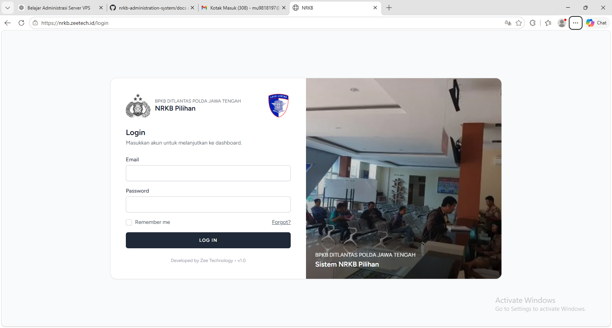
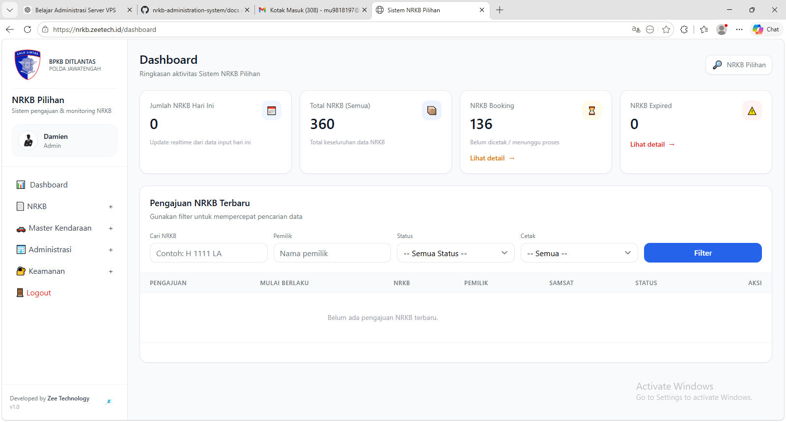

# NRKB Administration System

A Laravel-based administration and monitoring system designed to manage vehicle registration workflows efficiently.

## Overview

This system was developed to support administrative processes including:

- Vehicle registration workflow
- Booking & monitoring
- Status tracking
- Reporting & recap
- Master vehicle management
- Administrative security

## Features

- Authentication & Authorization
- Dashboard Monitoring
- Vehicle Registration Management
- Search & Filtering
- Reporting System
- Master Data Management
- Role-based Access Control

## Tech Stack

- Laravel
- MySQL
- Nginx
- Linux VPS
- Bootstrap / Blade

## System Architecture

- MVC Architecture
- Modular Administration System
- VPS Production Deployment

## Screenshots

### Login Page

### Dashboard

### NRKB Data Management

## Deployment

Production deployed on Linux VPS using:

- Nginx
- PHP-FPM
- MySQL
- SSL HTTPS

## Disclaimer

This repository is intended for portfolio and case study purposes only. Sensitive client data and proprietary business logic have been removed.

## Author

Supra Yogi
